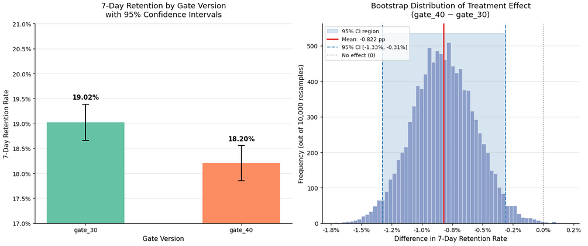
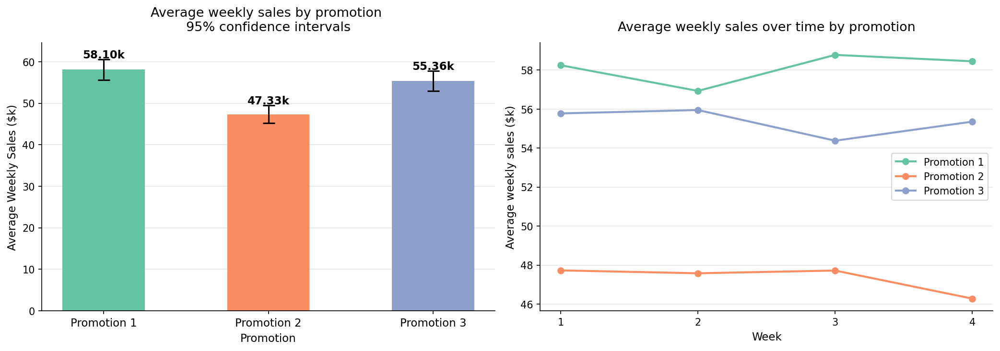

# DS.v3.2.2.5

# Analyzing A/B Tests 
This project explores two real-world A/B testing scenarios to evaluate the impact of different strategies on business outcomes:

Marketing Campaign Experiment – identifying the most effective promotion strategy for a new product

Cookie Cats Experiment – analyzing how game design changes affect on player retention

## Data Source

https://www.kaggle.com/datasets/chebotinaa/fast-food-marketing-campaign-ab-test

https://www.kaggle.com/datasets/mursideyarkin/mobile-games-ab-testing-cookie-cats

## Analytical structure

- data\cookie_cats.csv
  - raw data of cookie cats game
- data\WA_Marketing-campaign.csv
  - raw data of marketing campaign
- cookie_cats_main.ipynb.csv
  - A/B test of retaining customer
- Marketing-Camppaign_main.ipynb.csv
  - A/B test of 3 promotion comparisons

 
## A/B test results

### Mobile cookie cat

### Fast food marketing

## Stack 
 pandas 
 
 numpy
 
 scipy.stats
 
 matplotlib.pyplot
 
 matplotlib.ticker
 
 scipy.stats
 
 statsmodels.stats.multicomp
 
 scipy.stats
 
 statsmodels.stats.proportion
 
 - Most of these dependancy are being used once.
